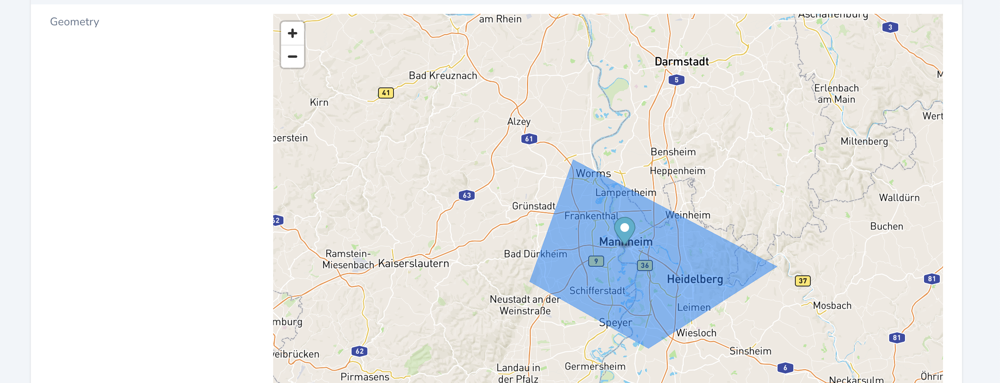

# Nova Mapbox Shape Field

## Requirements

- `php: >=8.0`
- `laravel/nova: ^4.1`

## Features

- Shows a geo shape with drawing capabilities

## Installation

Install the package in a Laravel Nova project via Composer:

```bash
composer require elbgoods/nova-mapbox-shape-field
```

## Usage

Expects a mapbox access-token specified in `config/services.php`:

```php
<?php

return [
    'mapbox' => [
        'key' => env('MAPBOX_KEY', 'your-default-key'),
    ],
```

```php
use Elbgoods\NovaMapboxShapeField\MapboxShapeField;

public function fields(Request $request)
{
    return [
        MapboxShapeField::make('Geometry') // Postgres Geometry Column
            ->latitude($this->latitude)
            ->longitude($this->longitude)
            ->geoJson($this->getGeoJson())
            ->zoom(8),
    ];
}
```

```php
    public function getGeoJson(): array
    {
        if ($this->geometry) {
            $geometry = $this->getGeometry(); // Brick\Geo\Geometry

            return [
                'type'        => $geometry->geometryType(),
                'coordinates' => $geometry->toArray(),
            ];
        }

        return [];
    }
```

## Screenshot



## License

This project is open-sourced software licensed under the [MIT license](LICENSE.md).
